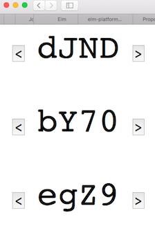

# PlugRc

A multi-device remote controller based on a simple
Elixir [Plug](https://github.com/elixir-lang/plug) Router,
and Event Source streaming over [Elm](http://elm-lang.org) ports for the front-end.
For the moment :-) steering just some browser
device showing some slides here http://zampino.github.io/talks.

Whenever a device connects, a remote control session appears
on the manager with a pair of buttons, streaming
_left_ and _right_ events over Event Source.
You can connect potentially
infinite slides and infinite controllers.


Devices are identified in the backend through erlang's `unique_integer`s and
the very nice [Hashids](http://hashids.org/elixir/).

It uses [Pastelli](https://github.com/zampino/pastelli) Plug adapter
for [elli](https://github.com/knutin/elli) erlang webserver.

It's live http://plugrc.herokuapp.com/index.html.

## Event Streams

Together with Pastelli routing and message serialization,
Elixir GenEvent streams offer a perfect abstraction for
server-sent-event sourcing, like in this very twenty lines of [code](https://github.com/zampino/plug_rc/blob/master/lib/plug_rc/event_stream.ex):

```elixir
defmodule EventStream do

  def start_link(conn) do
    {:ok, events_pid} = GenEvent.start_link
    Task.start_link __MODULE__, :stream, [conn, events_pid]
    {:ok, events_pid}
  end

  def stream(conn, events_pid) do
    GenEvent.stream(events_pid)
    |> Stream.each(&send_event(&1, conn))
    |> Stream.run
  end

  def send_event(event, conn) do
    # event here is an arbitrary Poison-serializable data, like a string or a map
    Pastelli.Conn.event conn, event
  end
end
```

Once your application starts a link to `EventStream` module and stores `events_pid`, then
it's just a matter of:

```elixir
GenEvent.ack_notify events_pid, %{hallo: "world"}
```
